# Plugin Dependency Graph

This document describes the dependencies between Mini-DM plugins. There are two types of dependencies:

1. **Explicit Dependencies**: Defined in the `dependencies` property of a plugin class
2. **Hook Dependencies**: Implicit dependencies through hooks (one plugin provides a hook, another consumes it)

## Dependency Types

### Explicit Dependencies

These are declared in the plugin's `dependencies` property and are required for the plugin to function.

```typescript
dependencies = {
  ldapGroups: 'core/ldap/ldapGroups',
  onLdapChange: 'core/ldap/onChange'
};
```

### Hook Dependencies

**Hook Providers**: Plugins that implement hooks (via `hooks: Hooks = { ... }`)
**Hook Consumers**: Plugins that call hooks (via `runHook()` or `launchHooks()`)

## Complete Dependency Graph

### Authentication Plugins

#### `authToken` (core/auth/token)
- **Dependencies**: None
- **Provides Hooks**: None
- **Consumes Hooks**: None
- **Notes**: Standalone authentication plugin

#### `authLemonldapNg` (core/auth/llng)
- **Dependencies**: None
- **Provides Hooks**: None
- **Consumes Hooks**: None
- **Notes**: LemonLDAP::NG SSO integration

#### `openidconnect` (core/auth/openidconnect)
- **Dependencies**: None
- **Provides Hooks**: None
- **Consumes Hooks**: `beforeAuth`, `afterAuth`
- **Notes**: OAuth2/OIDC authentication

#### `crowdsec` (core/auth/crowdsec)
- **Dependencies**: None
- **Provides Hooks**: None
- **Consumes Hooks**: None
- **Notes**: IP blocking via CrowdSec (must be loaded before auth plugins)

#### `rateLimit` (core/auth/rateLimit)
- **Dependencies**: None
- **Provides Hooks**: None
- **Consumes Hooks**: None
- **Notes**: Rate limiting (must be loaded before auth plugins)

#### `authzPerBranch` (core/auth/authzPerBranch)
- **Dependencies**: None (requires any auth plugin to be loaded first)
- **Provides Hooks**: Authorization hooks via `AuthzBase`
- **Consumes Hooks**: None
- **Notes**: Branch-level authorization

#### `authzLinid1` (core/auth/authzLinid1)
- **Dependencies**: None (requires any auth plugin to be loaded first)
- **Provides Hooks**: Authorization hooks via `AuthzBase`
- **Consumes Hooks**: None
- **Notes**: LinID 1.x authorization integration

### LDAP Core Plugins

#### `onLdapChange` (core/ldap/onChange)
- **Dependencies**: None
- **Provides Hooks**:
  - `ldapmodifyrequest` - Before LDAP modify
  - `ldapmodifydone` - After LDAP modify
- **Consumes Hooks**: (Fires these hooks for other plugins to consume)
  - `onLdapChange` - Any LDAP change
  - `onLdapMailChange` - Mail attribute changed
  - `onLdapQuotaChange` - Quota attribute changed
  - `onLdapForwardChange` - Forward attribute changed
  - `onLdapAliasChange` - Alias attribute changed
  - `onLdapDisplayNameChange` - Display name changed
- **Notes**: Core plugin for change detection and notification

#### `ldapFlatGeneric` (core/ldap/flatGeneric)
- **Dependencies**:
  - `departmentSync: 'core/ldap/departmentSync'` (optional)
- **Provides Hooks**: Dynamic hooks based on entity type (e.g., `ldap{Entity}add`, `ldap{Entity}modify`, etc.)
- **Consumes Hooks**: Entity-specific hooks
- **Notes**: Creates multiple plugin instances based on schemas

#### `ldapGroups` (core/ldap/groups)
- **Dependencies**: None
- **Provides Hooks**:
  - `ldapdeleterequest` - Before LDAP delete (checks group membership)
- **Consumes Hooks**:
  - `ldapgroupadd` - Before adding group
  - `ldapgroupadddone` - After adding group
  - `ldapgroupmodify` - Before modifying group
  - `ldapgroupmodifydone` - After modifying group
  - `ldapgrouprename` - Before renaming group
  - `ldapgrouprenamedone` - After renaming group
  - `ldapgroupdelete` - Before deleting group
  - `ldapgroupdeletedone` - After deleting group
  - `ldapgroupaddmember` - Before adding member
  - `ldapgroupdeletemember` - Before deleting member
  - `ldapgroupvalidatemembers` - Validate group members
  - `_ldapgrouplist` - Filter group list
  - `ldapgroupvalidatenew` - Validate new group
  - `ldapgroupvalidatechanges` - Validate group changes
- **Notes**: Central group management plugin

#### `ldapOrganizations` (core/ldap/organization)
- **Dependencies**: None
- **Provides Hooks**:
  - `ldapaddrequest` - Validates organization link/path on add
  - `ldapmodifyrequest` - Validates organization link/path on modify
  - `ldapdeleterequest` - Prevents deleting non-empty organizations
  - `ldaprenamerequest` - Validates organization renames
- **Consumes Hooks**:
  - `getOrganisationTop` - Filter top organization
- **Notes**: Hierarchical organization management

#### `ldapDepartmentSync` (core/ldap/departmentSync)
- **Dependencies**: None
- **Provides Hooks**:
  - `ldaprenamedone` - After organization rename/move, updates all resources
- **Consumes Hooks**: None
- **Notes**: Synchronizes department links when organizations are renamed

#### `externalUsersInGroups` (core/ldap/externalUsersInGroups)
- **Dependencies**:
  - `ldapGroups: 'core/ldap/ldapGroups'` ⚠️ **Required**
- **Provides Hooks**:
  - `ldapgroupvalidatemembers` - Auto-creates external users
- **Consumes Hooks**:
  - `externaluserentry` - Modify external user entry before creation
  - `externaluseradded` - After external user is created
- **Notes**: Auto-creates external contacts when added to groups

#### `trash` (core/ldap/trash)
- **Dependencies**: None
- **Provides Hooks**:
  - `ldapdeleterequest` - Intercepts deletes and moves to trash
- **Consumes Hooks**: None
- **Notes**: Soft delete system

#### `ldapBulkImport` (core/ldap/bulkImport)
- **Dependencies**: None
- **Provides Hooks**: None
- **Consumes Hooks**: None
- **Notes**: CSV-based bulk import (uses schema-driven configuration)

### Twake Integration Plugins

#### `james` (twake/james)
- **Dependencies**:
  - `onLdapChange: 'core/ldap/onChange'` ⚠️ **Required**
  - `ldapGroups: 'core/ldap/groups'` ⚠️ **Required**
- **Provides Hooks**:
  - `ldapadddone` - After user added
  - `onLdapMailChange` - Syncs mailbox on mail change
  - `onLdapAliasChange` - Syncs aliases
  - `onLdapQuotaChange` - Syncs quota
  - `onLdapForwardChange` - Syncs forwarding
  - `onLdapChange` - General LDAP change handling
  - `onLdapDisplayNameChange` - Syncs display name
  - `ldapgroupadddone` - After group added
  - `ldapgroupmodifydone` - After group modified
  - `ldapgroupdeletedone` - After group deleted
- **Consumes Hooks**: (Hooks provided by `onLdapChange`)
- **Notes**: Synchronizes LDAP users/groups with Apache James mail server

#### `calendarResources` (twake/calendarResources)
- **Dependencies**: None
- **Provides Hooks**:
  - `ldapcalendarResourceadddone` - After calendar resource added
  - `ldapcalendarResourcemodifydone` - After calendar resource modified
  - `ldapcalendarResourcedeletedone` - After calendar resource deleted
- **Consumes Hooks**: None
- **Notes**: Synchronizes calendar resources with Twake Calendar

### Utility Plugins

#### `static` (core/static)
- **Dependencies**: None
- **Provides Hooks**: None
- **Consumes Hooks**: None
- **Notes**: Serves static files and JSON schemas

#### `weblogs` (core/weblogs)
- **Dependencies**: None
- **Provides Hooks**: None
- **Consumes Hooks**: None
- **Notes**: HTTP request logging

#### `configApi` (core/configApi)
- **Dependencies**: None (reads configuration from other loaded plugins)
- **Provides Hooks**: None
- **Consumes Hooks**: None
- **Notes**: Exposes API configuration for frontend applications

### Demo Plugins

#### `hello` (demo/helloworld)
- **Dependencies**: None
- **Provides Hooks**: None
- **Consumes Hooks**: `hello` (demonstrates hook system)
- **Notes**: Example plugin for development/testing

## Dependency Chains

### Mail Server Integration Chain

```
james (twake/james)
  ├─→ requires: onLdapChange (core/ldap/onChange)
  │   └─→ provides: ldapmodifyrequest, ldapmodifydone
  │   └─→ fires: onLdapMailChange, onLdapQuotaChange, etc.
  └─→ requires: ldapGroups (core/ldap/groups)
      └─→ provides: ldapdeleterequest
      └─→ consumes: ldapgroup* hooks
```

### External Users Chain

```
externalUsersInGroups (core/ldap/externalUsersInGroups)
  └─→ requires: ldapGroups (core/ldap/ldapGroups)
      └─→ provides: ldapgroupvalidatemembers hook
      └─→ consumes: externaluserentry, externaluseradded hooks
```

### Organization Sync Chain

```
ldapFlatGeneric (core/ldap/flatGeneric)
  └─→ optionally uses: departmentSync (core/ldap/departmentSync)
      └─→ provides: ldaprenamedone hook
      └─→ updates resources when organizations are renamed
```

### Delete Interception Chain

```
trash (core/ldap/trash)
  └─→ provides: ldapdeleterequest hook
      └─→ intercepts deletes, moves to trash instead

ldapGroups (core/ldap/groups)
  └─→ provides: ldapdeleterequest hook
      └─→ checks group membership before delete

ldapOrganizations (core/ldap/organization)
  └─→ provides: ldapdeleterequest hook
      └─→ prevents deleting non-empty organizations
```

**Note**: Multiple plugins can provide the same hook. Hooks are executed as chains, allowing multiple plugins to participate in the same operation.

## Visual Dependency Graph

### ASCII Dependency Graph

```
┌─────────────────────────────────────────────────────────────────────────────┐
│                         AUTHENTICATION LAYER                                 │
├─────────────────────────────────────────────────────────────────────────────┤
│                                                                              │
│  ┌──────────┐  ┌──────────┐  ┌──────────────┐  ┌─────────────┐             │
│  │crowdsec  │  │rateLimit │  │authToken     │  │authLLNG     │             │
│  │          │  │          │  │              │  │             │             │
│  └──────────┘  └──────────┘  └──────────────┘  └─────────────┘             │
│                                                                              │
│                ┌──────────────┐  ┌─────────────┐  ┌─────────────┐          │
│                │openidconnect │  │authzPerBranch│  │authzLinid1 │          │
│                │              │  │             │  │             │          │
│                └──────────────┘  └─────────────┘  └─────────────┘          │
│                                                                              │
└─────────────────────────────────────────────────────────────────────────────┘
                                      │
                                      ▼
┌─────────────────────────────────────────────────────────────────────────────┐
│                            LDAP CORE LAYER                                   │
├─────────────────────────────────────────────────────────────────────────────┤
│                                                                              │
│  ┌────────────────┐         ┌──────────────┐         ┌───────────────┐     │
│  │  onChange      │         │   groups     │         │organizations  │     │
│  │  (change       │         │  (group      │         │  (org tree)   │     │
│  │  detection)    │         │  management) │         │               │     │
│  └────────────────┘         └──────────────┘         └───────────────┘     │
│         │                          │                          │             │
│         │                          │                          │             │
│         │                    ┌─────┴──────┐                  │             │
│         │                    │            │                  │             │
│         │         ┌──────────▼───────┐    │                  │             │
│         │         │externalUsers     │    │                  │             │
│         │         │InGroups          │    │                  │             │
│         │         │(auto-create)     │    │                  │             │
│         │         └──────────────────┘    │                  │             │
│         │                                 │                  │             │
│         │                          ┌──────▼──────────┐       │             │
│  ┌──────▼────────┐                │  flatGeneric    │◄──────┘             │
│  │departmentSync │◄───────────────│  (entity mgmt)  │                     │
│  │(org rename)   │  (optional)    │                 │                     │
│  └───────────────┘                └─────────────────┘                     │
│                                                                              │
│  ┌──────────┐  ┌──────────────┐                                            │
│  │  trash   │  │ bulkImport   │                                            │
│  │(soft del)│  │  (CSV import)│                                            │
│  └──────────┘  └──────────────┘                                            │
│                                                                              │
└─────────────────────────────────────────────────────────────────────────────┘
                                      │
                                      ▼
┌─────────────────────────────────────────────────────────────────────────────┐
│                       INTEGRATION LAYER                                      │
├─────────────────────────────────────────────────────────────────────────────┤
│                                                                              │
│  ┌────────────────────────────┐      ┌──────────────────────────┐          │
│  │        james               │      │  calendarResources       │          │
│  │  (Apache James sync)       │      │  (Twake Calendar sync)   │          │
│  │                            │      │                          │          │
│  │  Requires:                 │      │                          │          │
│  │    • onChange ─────────────┼──┐   │                          │          │
│  │    • groups ───────────────┼──┘   │                          │          │
│  └────────────────────────────┘      └──────────────────────────┘          │
│                                                                              │
└─────────────────────────────────────────────────────────────────────────────┘
                                      │
                                      ▼
┌─────────────────────────────────────────────────────────────────────────────┐
│                         UTILITY LAYER                                        │
├─────────────────────────────────────────────────────────────────────────────┤
│                                                                              │
│  ┌──────────┐  ┌──────────┐  ┌──────────────┐                              │
│  │  static  │  │ weblogs  │  │  configApi   │                              │
│  │(files)   │  │(logging) │  │(config API)  │                              │
│  └──────────┘  └──────────┘  └──────────────┘                              │
│                                                                              │
└─────────────────────────────────────────────────────────────────────────────┘


Legend:
  ──►  Explicit dependency (required)
  ◄──  Optional dependency
  │    Hook relationship
```

### Detailed Dependency Connections

```
┌──────────────────────────────────────────────────────────────┐
│ EXPLICIT DEPENDENCIES (Plugin A requires Plugin B)           │
└──────────────────────────────────────────────────────────────┘

james                 ──────►  onChange (core/ldap/onChange)
                      ──────►  groups (core/ldap/groups)

externalUsersInGroups ──────►  groups (core/ldap/groups)

flatGeneric           ─ ─ ─►  departmentSync (optional)


┌──────────────────────────────────────────────────────────────┐
│ HOOK DEPENDENCIES (Plugin A fires hooks, Plugin B consumes)  │
└──────────────────────────────────────────────────────────────┘

onChange ─┬─ fires ──► onLdapChange ────────► james
          ├─ fires ──► onLdapMailChange ────► james
          ├─ fires ──► onLdapQuotaChange ───► james
          ├─ fires ──► onLdapAliasChange ───► james
          ├─ fires ──► onLdapForwardChange ─► james
          └─ fires ──► onLdapDisplayNameChange ─► james

groups ───── fires ──► ldapgroupvalidatemembers ──► externalUsersInGroups

departmentSync ── fires ──► ldaprenamedone ──► flatGeneric instances


┌──────────────────────────────────────────────────────────────┐
│ HOOK PROVIDERS (Plugins that intercept LDAP operations)      │
└──────────────────────────────────────────────────────────────┘

LDAP Delete Request Chain (multiple plugins):
  trash           ──► ldapdeleterequest (moves to trash)
  groups          ──► ldapdeleterequest (checks members)
  organizations   ──► ldapdeleterequest (checks empty)

LDAP Modify Request Chain:
  onChange        ──► ldapmodifyrequest (detects changes)
  organizations   ──► ldapmodifyrequest (validates org links)

LDAP Add Request Chain:
  organizations   ──► ldapaddrequest (validates org links)

LDAP Rename Request Chain:
  organizations   ──► ldaprenamerequest (validates renames)
```

### Mermaid Diagram (for GitHub/viewers)

```mermaid
graph TB
    %% Authentication plugins
    authToken[authToken]
    authLLNG[authLemonldapNg]
    openidconnect[openidconnect]
    crowdsec[crowdsec]
    rateLimit[rateLimit]
    authzPerBranch[authzPerBranch]
    authzLinid1[authzLinid1]

    %% LDAP Core
    onChange[onLdapChange]
    flatGeneric[ldapFlatGeneric]
    groups[ldapGroups]
    organizations[ldapOrganizations]
    departmentSync[ldapDepartmentSync]
    externalUsers[externalUsersInGroups]
    trash[trash]
    bulkImport[ldapBulkImport]

    %% Twake Integration
    james[james]
    calendar[calendarResources]

    %% Utility
    static[static]
    weblogs[weblogs]
    configApi[configApi]

    %% Explicit dependencies
    james -->|requires| onChange
    james -->|requires| groups
    externalUsers -->|requires| groups
    flatGeneric -.->|optionally uses| departmentSync

    %% Hook dependencies (major ones)
    onChange -.->|fires hooks| james
    groups -.->|validates members| externalUsers

    %% Styling
    classDef auth fill:#e1f5ff,stroke:#0288d1
    classDef ldap fill:#e8f5e9,stroke:#388e3c
    classDef twake fill:#fff3e0,stroke:#f57c00
    classDef util fill:#f3e5f5,stroke:#7b1fa2

    class authToken,authLLNG,openidconnect,crowdsec,rateLimit,authzPerBranch,authzLinid1 auth
    class onChange,flatGeneric,groups,organizations,departmentSync,externalUsers,trash,bulkImport ldap
    class james,calendar twake
    class static,weblogs,configApi util
```



## Loading Order Recommendations

### 1. Security Plugins (must load first)
1. `crowdsec` - IP blocking
2. `rateLimit` - Rate limiting

### 2. Authentication Plugins
3. `authToken` OR `authLemonldapNg` OR `openidconnect`
4. `authzPerBranch` OR `authzLinid1` (optional, after auth)

### 3. LDAP Core Plugins
5. `onChange` - Required by `james`
6. `groups` - Required by `james` and `externalUsersInGroups`
7. `organizations` - Organization management
8. `departmentSync` - Before `flatGeneric` if using department sync
9. `flatGeneric` - Entity management
10. `externalUsersInGroups` - After `groups`
11. `trash` - Soft delete (optional)
12. `bulkImport` - Bulk import (optional)

### 4. Integration Plugins
13. `james` - After `onChange` and `groups`
14. `calendarResources` - Calendar sync (optional)

### 5. Utility Plugins (can load anytime)
- `static` - Static files
- `weblogs` - Logging
- `configApi` - Configuration API

## Plugin Priority System

Mini-DM uses a priority system defined in `src/plugins/priority.json`:

```json
[
  "core/auth/crowdsec",
  "core/auth/rateLimit",
  "core/auth/token",
  "core/auth/llng",
  "core/auth/openidconnect",
  "core/auth/authzPerBranch",
  "core/auth/authzLinid1"
]
```

Plugins in this list load before others, ensuring security plugins run first.

## Hook Execution Order

Hooks are executed in the order plugins are loaded. For chained hooks:

1. First plugin in chain can modify/validate data
2. Returns modified data to next plugin
3. Last plugin's return value is used

For non-chained hooks:
- All hooks execute in parallel
- Order doesn't matter

**Example**: `ldapdeleterequest` chain
```
Request → trash (moves to trash) → groups (checks members) → organizations (checks empty) → LDAP
```

## Creating Plugins with Dependencies

### Explicit Dependencies

```typescript
export default class MyPlugin extends DmPlugin {
  name = 'myPlugin';

  dependencies = {
    ldapGroups: 'core/ldap/ldapGroups',
    onChange: 'core/ldap/onChange'
  };
}
```

### Consuming Hooks

```typescript
export default class MyPlugin extends DmPlugin {
  hooks: Hooks = {
    onLdapMailChange: async ([dn, oldMail, newMail]) => {
      // React to mail changes
      console.log(`Mail changed from ${oldMail} to ${newMail}`);
    }
  };
}
```

### Providing Hooks

```typescript
export default class MyPlugin extends DmPlugin {
  async someMethod() {
    // Fire a hook for other plugins to consume
    await this.server.launchHooks('myCustomHook', [param1, param2]);
  }
}
```

## Dependency Validation

Mini-DM validates dependencies at startup:

1. Checks all `dependencies` properties
2. Ensures required plugins are loaded
3. Fails with error if dependencies missing
4. Logs warning for optional dependencies

## Best Practices

1. **Declare explicit dependencies**: Use `dependencies` property for hard requirements
2. **Document hook dependencies**: Comment which hooks your plugin consumes
3. **Use optional dependencies carefully**: Check if plugin is loaded before using
4. **Respect load order**: Security → Auth → LDAP → Integration → Utility
5. **Test plugin isolation**: Ensure plugin works when optional dependencies are missing
6. **Avoid circular dependencies**: Plugin A shouldn't require Plugin B if B requires A
7. **Use hooks for loose coupling**: Prefer hooks over direct plugin references

## See Also

- [Plugin Development Guide](DEVELOPER_GUIDE.md)
- [Hook System Documentation](../src/hooks/README.md)
- [Plugin Priority Configuration](../src/plugins/priority.json)
